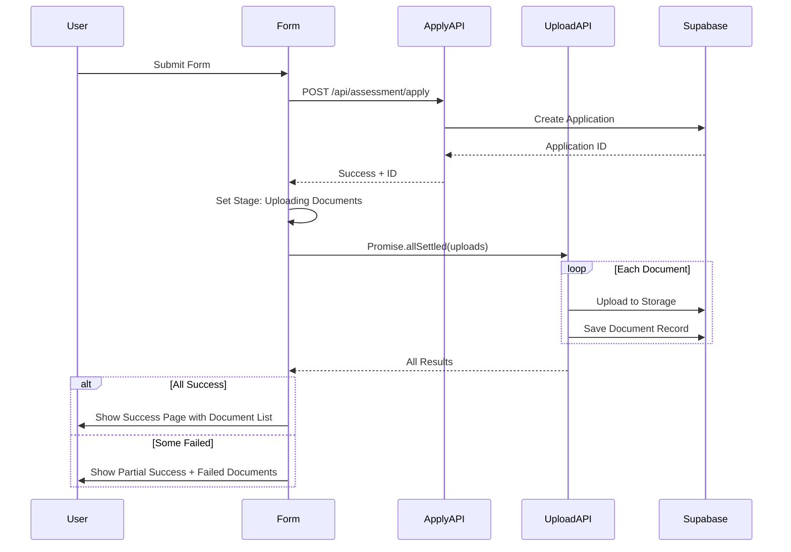

## Assessment Form File Upload Issues - Requirement Analysis

### 问题概述

评估申请表单的文件上传功能存在多个问题,影响用户体验和数据完整性。

### 核心问题

1. **文件上传静默失败 (Critical)**

- 文档上传失败时仅记录控制台错误
- 用户看到"申请提交成功"即使文档上传失败
- 没有重试机制或失败通知

2. **缺少上传进度反馈 (UX)**

- 提交时无加载指示器显示文档上传进度
- 用户不知道表单仍在处理中

3. **顺序上传性能问题**

- 文档逐个上传而非并行上传
- 多文档上传速度慢

4. **成功页面缺少文档状态**

- 提交成功后不显示哪些文档已上传
- 用户无法验证文档是否接收成功

5. **未使用的文件输入引用 (Code Quality)**

- 所有文档输入共享同一个从未使用的 ref

### 预期功能

- 文档上传失败时明确通知用户
- 显示文档上传进度
- 并行上传多个文档
- 成功页面显示文档上传状态
- 清理未使用的代码

## 技术方案

### 技术栈

- **Frontend**: React 19 + TypeScript + Next.js 16
- **UI Components**: shadcn/ui (Toast, Progress, Badge)
- **Backend**: Supabase Storage + PostgreSQL
- **API**: `/api/assessment/upload` (POST), `/api/assessment/apply` (POST)

### 实现方案

#### 1. 文档上传状态管理

**方案**: 引入上传状态跟踪机制

- 使用 `useState` 跟踪每个文档的上传状态
- 状态类型: `pending` | `uploading` | `success` | `error`
- 失败时显示具体错误信息并提供重试选项

#### 2. 并行上传优化

**方案**: 使用 `Promise.allSettled` 替代 `for...of`

```typescript
// 当前: 顺序上传
for (const file of files) { await upload(file); }

// 优化: 并行上传
const results = await Promise.allSettled(files.map(file => upload(file)));
```

- 所有文档同时上传,提升速度
- 每个上传独立处理成功/失败
- 收集所有结果后统一反馈

#### 3. 上传进度反馈

**方案**: 多阶段加载状态

- 阶段1: 提交表单数据
- 阶段2: 上传文档
- 显示当前处理阶段和进度
- 使用 Toast 通知上传结果

#### 4. 成功页面增强

**方案**: 显示文档上传摘要

- 列出所有尝试上传的文档
- 标记成功/失败状态
- 失败文档提供"稍后上传"提示
- 跟踪码页面支持补充上传

### 架构设计



### 实现细节

#### 类型定义

```typescript
interface UploadStatus {
  documentType: string;
  status: 'pending' | 'uploading' | 'success' | 'error';
  error?: string;
  fileName: string;
}

interface SubmissionState {
  stage: 'form' | 'documents' | 'complete';
  uploadResults: UploadStatus[];
}
```

#### 错误处理策略

- 网络错误: 显示连接失败,提供重试
- 文件过大: 显示文件大小限制
- 文件类型错误: 显示允许的文件类型
- 服务器错误: 显示系统错误信息

### 目录结构

```
src/app/assessment/apply/
├── page.tsx                 # [MODIFY] 主表单页面
│   - 添加上传状态管理
│   - 实现并行上传
│   - 增强成功页面
│   - 清理未使用 ref
└── components/              # [NEW] 组件目录
    ├── upload-status-list.tsx    # 上传状态列表
    └── document-upload-progress.tsx  # 上传进度组件
```

### 性能考量

- **并行上传**: 5个文档从 5个请求/秒 → 5个请求同时进行
- **错误隔离**: 单个文档失败不影响其他文档
- **用户体验**: 2秒内反馈所有上传结果

### 可测试性

- 单元测试: 上传状态管理逻辑
- 集成测试: 完整提交流程
- E2E测试: 多文档上传场景

## Agent Extensions

### Skill

- **agent-browser**
- Purpose: Test the assessment form file upload functionality after fixes
- Expected outcome: Verify that file upload errors are properly displayed, upload progress is shown, and success page displays document status