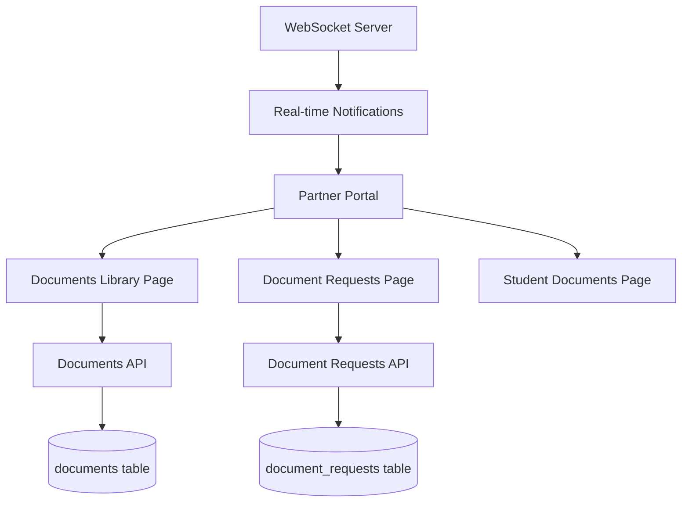

## Product Overview

为合作伙伴管理员和团队成员增强文档管理系统，提供集中式文档库、文档请求工作流、批量操作、通知提醒和完整的审计追踪功能。

## Core Features

- **集中式文档库**: 创建统一的文档管理页面，支持查看所有学生的文档
- **文档请求功能**: 合作伙伴可请求学生上传缺失文档，设置截止日期和优先级
- **文档审核工作流**: 允许合作伙伴验证或拒绝文档（目前只有管理员可操作）
- **批量操作**: 支持批量下载、批量验证、批量请求文档
- **通知系统**: 文档上传、验证、拒绝时发送实时通知
- **文档过期追踪**: 追踪护照、签证、体检报告等过期日期
- **文档统计仪表盘**: 展示文档状态分布、待处理文档数量等关键指标
- **高级筛选排序**: 按学生、文档类型、状态、日期等多维度筛选
- **完整审计追踪**: 可视化显示所有文档操作历史
- **团队权限控制**: 区分 partner_admin 和 member 的访问权限

## Tech Stack

- Framework: Next.js 16 (App Router) + React 19 + TypeScript 5
- UI Components: shadcn/ui + Tailwind CSS 4
- Database: Supabase (PostgreSQL)
- Real-time: WebSocket (已有实现)
- Storage: Supabase Storage (documents bucket)

## Implementation Approach

### Phase 1: 数据库架构增强

扩展 `documents` 表，添加过期追踪字段；创建 `document_requests` 表用于文档请求功能；创建 `document_notifications` 表用于通知管理。

### Phase 2: API 端点开发

创建集中式文档查询 API、文档请求 API、批量操作 API、通知 API 和统计 API。

### Phase 3: UI 页面开发

创建文档库页面、文档请求管理页面、文档统计仪表盘组件。

### Phase 4: 通知与实时更新

集成现有 WebSocket 系统，实现文档相关实时通知。

## Architecture Design

### 系统架构图



### 数据流

1. 文档上传: Partner/Student → API → Supabase Storage → documents table → WebSocket notification
2. 文档请求: Partner → API → document_requests table → Email notification to student
3. 文档验证: Partner/Admin → API → Update documents.status → WebSocket notification

## Directory Structure Summary

新增文档管理增强相关文件，包括 API 路由、页面组件、数据库迁移脚本。

```
project-root/
├── src/
│   ├── app/
│   │   ├── (partner-v2)/partner-v2/
│   │   │   └── documents/                      # [NEW] 集中式文档库页面
│   │   │       ├── page.tsx                    # 文档库主页面，支持筛选、排序、批量操作
│   │   │       └── requests/
│   │   │           └── page.tsx                # [NEW] 文档请求管理页面
│   │   └── api/
│   │       └── partner/
│   │           └── documents/
│   │               ├── route.ts                # [NEW] 集中式文档查询 API
│   │               ├── bulk/
│   │               │   └── route.ts            # [NEW] 批量操作 API
│   │               ├── stats/
│   │               │   └── route.ts            # [NEW] 文档统计 API
│   │               └── requests/
│   │                   └── route.ts            # [NEW] 文档请求 CRUD API
│   ├── components/partner-v2/
│   │   ├── document-library-filters.tsx        # [NEW] 文档库筛选组件
│   │   ├── document-request-dialog.tsx         # [NEW] 文档请求对话框
│   │   ├── document-stats-cards.tsx            # [NEW] 文档统计卡片
│   │   └── document-expiry-alerts.tsx          # [NEW] 过期提醒组件
│   └── lib/
│       └── partner/
│           └── document-utils.ts               # [NEW] 文档工具函数
├── migrations/
│   └── 20250417_document_enhancements.sql      # [NEW] 数据库迁移脚本
└── src/app/api/documents/
    └── [id]/verify/
        └── route.ts                            # [NEW] 文档验证 API (Partner可用)
```

## Implementation Notes

- **性能优化**: 文档列表使用分页加载，批量操作使用事务处理
- **权限控制**: 复用现有 `usePartner()` context 和 `isPartnerAdmin()` 函数
- **通知集成**: 复用现有 `PartnerRealtimeProvider` 和 WebSocket 系统
- **存储安全**: 文档 URL 使用 Supabase signed URLs (1小时有效期)
- **审计追踪**: 复用现有 `activity_log` 表，添加文档相关操作类型

## Agent Extensions

### Skill

- **supabase-postgres-best-practices**
- Purpose: Optimize database queries for document management features
- Expected outcome: Efficient document queries with proper indexing and RLS policies

### SubAgent

- **code-explorer**
- Purpose: Explore existing notification system and WebSocket implementation patterns
- Expected outcome: Understand how to integrate document notifications with existing real-time system