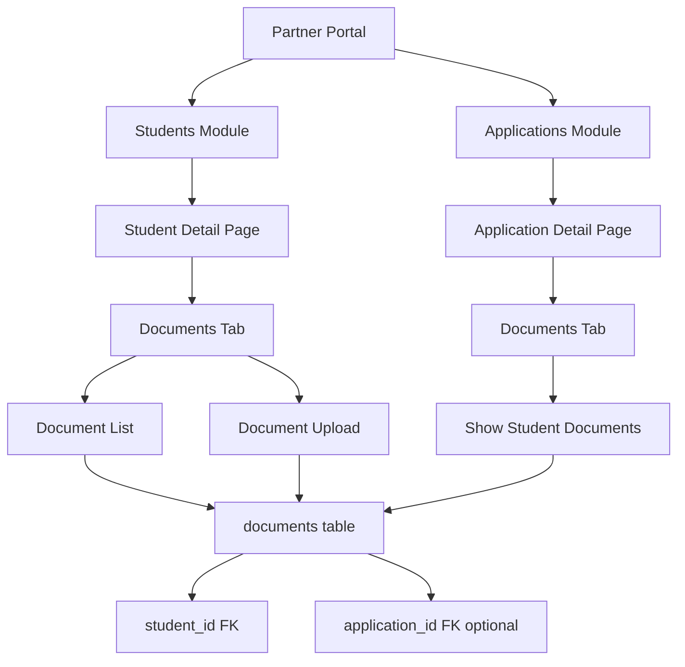

## 产品概述

在合作伙伴门户中增强文档管理功能，确保上传的文档能够正确显示并与学生和申请关联，允许合作伙伴及其团队成员管理学生的文档。

## 核心功能

### 1. 学生模块文档管理

- 在学生详情页添加"Documents"标签页
- 显示学生的所有上传文档
- 支持合作伙伴及团队成员上传、查看、下载、删除文档
- 文档按类型分类展示（护照、文凭、成绩单、语言证书等）

### 2. 申请文档显示优化

- 确保申请详情页的 Documents tab 正确显示学生文档
- 文档来源于学生档案，可跨申请复用
- 显示文档状态（待审核、已验证、已拒绝）

### 3. 权限控制

- Partner Admin：可访问团队所有学生推荐的学生的文档
- Partner Member：只能访问自己推荐学生的文档
- 支持文档的上传、查看、下载、删除操作

### 4. 文档上传功能

- 支持多种文档类型
- 文件大小限制：10MB
- 支持的文件格式：PDF、图片、Word文档
- 自动生成文档预览和下载链接

## 技术栈

- **框架**: Next.js 16 (App Router) with TypeScript
- **UI 组件**: shadcn/ui (Card, Tabs, Table, Button, Badge, Dialog)
- **样式**: Tailwind CSS
- **数据库**: Supabase (PostgreSQL)
- **存储**: Supabase Storage (documents bucket)
- **状态管理**: React useState/useEffect

## 实现方案

### 架构设计



### 数据库架构

现有 `documents` 表已满足需求：

- `student_id`: 文档归属学生（必需）
- `application_id`: 可选关联到特定申请
- `type`: 文档类型（已标准化）
- `file_key`: Supabase Storage 路径
- `uploaded_by`: 上传者用户ID

### API 设计

1. **GET /api/partner/students/[id]** - 扩展返回文档列表
2. **GET /api/documents?student_id=xxx** - 获取学生文档（已存在）
3. **POST /api/documents** - 上传文档（已存在，支持 student_id）
4. **DELETE /api/documents?id=xxx** - 删除文档（已存在）

### 权限控制

使用现有的 `canAccessStudent()` 和 `canPartnerAccessApplication()` 函数：

- Partner Admin: 通过 `getPartnerAdminId()` 获取团队所有成员推荐的学生
- Partner Member: 仅访问自己推荐的学生

## 目录结构

```
project-root/
├── src/app/(partner-v2)/partner-v2/
│   ├── students/
│   │   └── [id]/
│   │       ├── page.tsx              # [MODIFY] 添加 Documents tab
│   │       └── documents/
│   │           └── page.tsx          # [NEW] 学生文档管理页面
│   └── applications/
│       └── [id]/
│           ├── page.tsx              # [KEEP] 已有 Documents tab
│           └── documents/
│               └── page.tsx          # [KEEP] 已有文档管理页面
│
├── src/app/api/
│   └── partner/
│       └── students/
│           └── [id]/
│               └── route.ts          # [MODIFY] 返回文档列表
│
└── src/components/partner-v2/
    └── student-documents-list.tsx    # [NEW] 学生文档列表组件
```

## 实现细节

### 1. 学生详情页修改

在 `src/app/(partner-v2)/partner-v2/students/[id]/page.tsx`：

- 添加 "Documents" TabsTrigger
- 添加 TabsContent 显示文档列表摘要
- 添加"管理文档"按钮跳转到文档管理页

### 2. 学生 API 扩展

在 `src/app/api/partner/students/[id]/route.ts` GET 方法：

- 查询 `documents` 表获取学生文档
- 返回文档统计信息
- 保持现有权限检查

### 3. 学生文档管理页面

创建 `src/app/(partner-v2)/partner-v2/students/[id]/documents/page.tsx`：

- 类似申请文档管理页面的设计
- 文档上传表单
- 文档网格展示
- 图片预览和 PDF 查看
- 下载和删除功能

### 4. 文档列表组件

创建可复用的 `StudentDocumentsList` 组件：

- 接受 `studentId` 和 `documents` 数组
- 显示文档类型、状态、大小、上传时间
- 提供下载和删除操作

## Agent Extensions

### Skill

- **lucide-icons**
- Purpose: 下载文档管理所需的图标（上传、下载、文件类型图标）
- Expected outcome: 获取 IconFile, IconUpload, IconDownload, IconTrash 等图标

### SubAgent

- **code-explorer**
- Purpose: 探索现有文档管理组件和API模式的详细实现
- Expected outcome: 理解现有文档上传流程、权限控制逻辑、UI组件结构