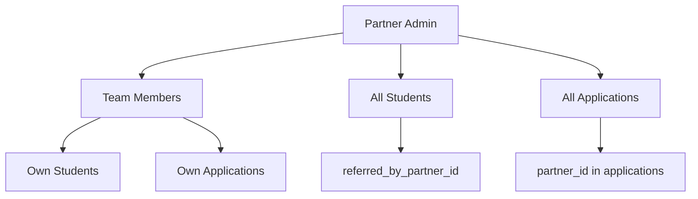

## 产品概述

统一优化合作伙伴门户（Partner Admin 和 Partner Member）的架构，确保数据同步、权限控制、UI一致性，参考学生模块的成功实践。

## 核心功能

1. **统一角色验证系统** - 创建标准化的角色检查工具函数
2. **数据可见性优化** - 简化学生/申请数据的可见性逻辑
3. **实时数据同步** - 集成 WebSocket 实现团队协作
4. **UI 一致性** - 统一容器设计和页面布局
5. **活动日志完善** - 完整的操作审计跟踪
6. **API 标准化** - 统一的 API 响应格式和错误处理

## 技术栈

- **框架**: Next.js 16 (App Router) + React 19
- **UI**: shadcn/ui + Tailwind CSS
- **数据库**: Supabase PostgreSQL
- **实时通信**: WebSocket (现有 `ws-client.ts`)
- **语言**: TypeScript 5

## 架构设计

### 1. 角色验证架构

```
┌─────────────────────────────────────────┐
│         Partner Auth Layer              │
├─────────────────────────────────────────┤
│  verifyPartnerRole()                    │
│  ├── partner_admin: Full access         │
│  └── member: Limited access             │
├─────────────────────────────────────────┤
│  getPartnerContext()                    │
│  ├── adminId: string                    │
│  ├── teamMemberIds: string[]            │
│  └── visibleStudentIds: string[]        │
└─────────────────────────────────────────┘
```

### 2. 数据可见性模型



### 3. 实时同步架构

```
Partner Portal WebSocket Flow:
┌──────────────┐    ┌──────────────┐    ┌──────────────┐
│ Partner A    │───▶│ WebSocket    │───▶│ Partner B    │
│ (Admin)      │    │ Server       │    │ (Member)     │
└──────────────┘    └──────────────┘    └──────────────┘
       │                   │                   │
       ▼                   ▼                   ▼
  Student Update    Broadcast Update    Receive Update
  Application       to Team             Refresh UI
```

## 目录结构

```
src/
├── lib/
│   └── partner/
│       ├── context.ts          # [NEW] Partner context provider
│       ├── roles.ts            # [NEW] Role utilities
│       ├── visibility.ts       # [NEW] Data visibility logic
│       └── realtime.ts         # [NEW] WebSocket hooks
├── components/partner-v2/
│   ├── partner-provider.tsx    # [NEW] Real-time provider
│   ├── partner-sidebar.tsx     # [MODIFY] Use unified roles
│   └── partner-layout.tsx      # [NEW] Standard container
├── app/(partner-v2)/partner-v2/
│   ├── students/
│   │   ├── page.tsx            # [MODIFY] Standard container
│   │   ├── [id]/page.tsx       # [MODIFY] Standard container
│   │   └── new/page.tsx        # [MODIFY] Standard container
│   ├── applications/
│   │   ├── page.tsx            # [MODIFY] Standard container
│   │   └── [id]/page.tsx       # [MODIFY] Standard container
│   └── team/
│       └── page.tsx            # [MODIFY] Standard container
└── app/api/partner/
    ├── students/route.ts       # [MODIFY] Use visibility utils
    ├── applications/route.ts   # [MODIFY] Use visibility utils
    └── activity/route.ts       # [MODIFY] Unified activity log
```

## 实现要点

### 1. 统一角色验证

```typescript
// lib/partner/roles.ts
export function isPartnerAdmin(user: { partner_role?: string | null }): boolean {
  return !user.partner_role || user.partner_role === 'partner_admin';
}

export function canAccessTeamManagement(user: PartnerUser): boolean {
  return isPartnerAdmin(user);
}
```

### 2. 数据可见性工具

```typescript
// lib/partner/visibility.ts
export async function getVisibleStudentIds(partnerUser: PartnerUser): Promise<string[]> {
  const supabase = getSupabaseClient();
  
  if (isPartnerAdmin(partnerUser)) {
    // Admin sees all team members' students
    const teamIds = await getTeamMemberIds(partnerUser.id);
    // Query students where referred_by_partner_id IN teamIds
  } else {
    // Member sees only their own students
    return [partnerUser.id];
  }
}
```

### 3. 实时同步 Provider

```typescript
// components/partner-v2/partner-provider.tsx
export function PartnerRealtimeProvider({ children }) {
  // Subscribe to partner_team_activity updates
  // Broadcast changes to connected team members
}
```

### 4. 统一容器设计

```typescript
// 所有 partner-v2 页面使用统一布局
<div className="max-w-7xl mx-auto p-4 md:p-6">
  {/* Page header */}
  <div className="mb-6">{/* ... */}</div>
  
  {/* Content in Card */}
  <Card>
    <CardContent className="p-6">{/* ... */}</CardContent>
  </Card>
</div>
```

## 性能优化

- 使用 React Context 缓存角色和团队信息
- WebSocket 消息节流 (300ms)
- 数据库查询使用索引 (`partner_role`, `partner_id`, `referred_by_partner_id`)
- 客户端数据缓存减少 API 调用