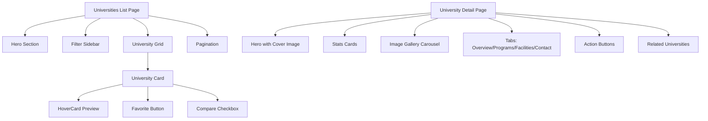

## Product Overview

增强学生门户的大学模块，使用 shadcn 组件实现专业、现代的 UI 设计。将基础的列表页和详情页转化为功能丰富、视觉吸引的界面。

## Core Features

### 列表页增强功能

- Hero 区域与统计概览（大学总数、奖学金覆盖、热门城市）
- 高级筛选侧边栏（省份、类型、学费范围、排名范围）
- 网格/列表视图切换
- 排序选项（排名、名称、学费）
- 悬停预览卡片
- 收藏/书签功能
- 大学比较功能
- 专业分页组件

### 详情页增强功能

- 带封面图渐变叠加的 Hero 区域
- 校园图片画廊轮播
- 快速统计卡片（排名、学生数、国际生比例）
- 核心亮点展示区
- 增强的项目展示区域（带筛选和分类）
- 校园设施卡片
- 操作按钮组（立即申请、收藏、分享、比较）
- 相关大学推荐

## Tech Stack

- **Framework**: Next.js 16 (App Router)
- **Core**: React 19
- **Language**: TypeScript 5
- **UI Components**: shadcn/ui
- **Styling**: Tailwind CSS 4
- **Icons**: @tabler/icons-react
- **Database**: Supabase (PostgreSQL)

## Implementation Approach

### Design Philosophy

- 现代、简洁的界面设计，配以微妙的动画效果
- 信息层次分明，视觉重点突出
- 移动优先的响应式设计
- 无障碍访问合规的组件
- 性能优化，支持懒加载

### Key Technical Decisions

1. **组件架构**: 创建可复用的列表页和详情页组件
2. **状态管理**: 使用 React hooks 管理本地状态，URL 参数管理筛选
3. **性能优化**: 大列表虚拟化，图片懒加载
4. **缓存策略**: 利用现有 API 缓存大学数据

## Architecture Design



## Directory Structure

```
project-root/
├── src/app/(student-v2)/student-v2/universities/
│   ├── page.tsx                           # [MODIFY] 增强列表页
│   ├── [id]/
│   │   └── page.tsx                       # [MODIFY] 增强详情页
│   └── compare/
│       └── page.tsx                       # [NEW] 大学比较页面
├── src/components/student-v2/universities/
│   ├── university-hero-section.tsx        # [NEW] Hero 区域统计组件
│   ├── university-filter-sidebar.tsx      # [NEW] 高级筛选侧边栏
│   ├── university-card-enhanced.tsx       # [NEW] 增强版大学卡片
│   ├── university-hover-preview.tsx       # [NEW] HoverCard 预览组件
│   ├── university-grid.tsx                # [NEW] 网格/列表视图容器
│   ├── university-comparison-bar.tsx      # [NEW] 比较栏组件
│   ├── university-detail-hero.tsx         # [NEW] 详情页 Hero
│   ├── university-stats-cards.tsx         # [NEW] 统计卡片
│   ├── university-image-gallery.tsx       # [NEW] 图片轮播
│   ├── university-programs-section.tsx    # [NEW] 增强项目区域
│   ├── university-action-buttons.tsx      # [NEW] 操作按钮组
│   └── university-related.tsx             # [NEW] 相关大学推荐
└── src/hooks/
    └── use-university-favorites.ts        # [NEW] 收藏功能 Hook
```

## Key Code Structures

### University Card Enhanced Props

```typescript
interface UniversityCardEnhancedProps {
  university: University;
  viewMode: 'grid' | 'list';
  isFavorite: boolean;
  isComparing: boolean;
  onFavoriteToggle: (id: string) => void;
  onCompareToggle: (id: string) => void;
}
```

### Filter State Interface

```typescript
interface UniversityFilters {
  search: string;
  province: string;
  type: string;
  category: string;
  scholarship: boolean;
  englishTaught: boolean;
  tuitionRange: [number, number];
  rankingRange: [number, number];
  sortBy: 'ranking' | 'name' | 'tuition';
  sortOrder: 'asc' | 'desc';
}
```

## Design Style

采用现代专业设计风格，强调信息密度与视觉层次。使用渐变、阴影和微交互提升用户体验。

### 列表页布局

- **Hero 区域**: 渐变背景统计卡片，展示关键数据
- **筛选区**: 左侧固定侧边栏（桌面）/ Sheet 抽屉（移动端）
- **卡片网格**: 响应式 1-3 列布局
- **比较栏**: 底部固定比较工具栏

### 详情页布局

- **Hero 区域**: 全宽封面图 + 渐变叠加 + 大学信息
- **统计卡片**: 4 列数据展示
- **图片画廊**: Carousel 组件展示校园照片
- **标签页**: Overview / Programs / Facilities / Contact
- **操作区**: 固定底部操作按钮

### Components to Use

- Card, CardContent, CardHeader, CardTitle, CardDescription
- Badge with variants (985/211/Scholarship)
- Button with icon variants
- Carousel for image gallery
- HoverCard for quick preview
- Sheet for mobile filter panel
- Tabs for detail sections
- Skeleton for loading states
- Pagination component
- ScrollArea for filter sidebar
- Separator for content division
- Tooltip for additional info

## Agent Extensions

### Skill

- **ui-ux-pro-max**
- Purpose: 获取专业 UI/UX 设计指导和最佳实践
- Expected outcome: 确保设计符合现代标准，组件使用最佳实践

### Skill

- **lucide-icons**
- Purpose: 搜索和下载所需的图标
- Expected outcome: 获取一致的图标资源用于 UI 组件