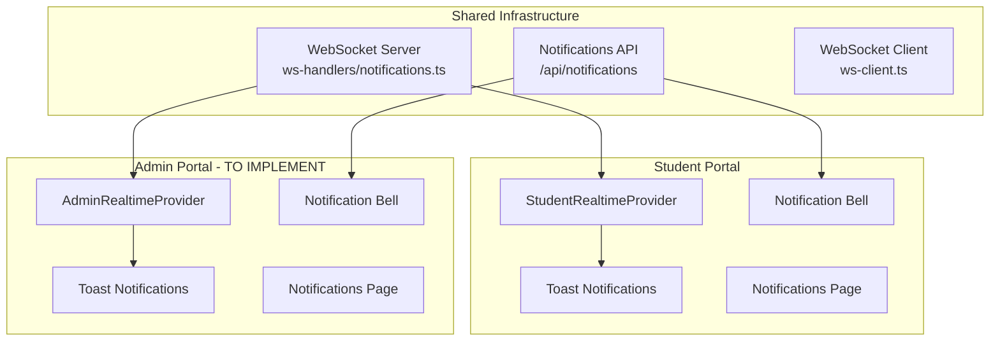

## User Requirements

Sync the notification system between student portal and admin portal so that admin has the same real-time notification capabilities.

## Product Overview

The admin portal currently lacks real-time notification features that exist in the student portal. This task will add WebSocket-based real-time notifications, toast notifications, notification bell UI, and notifications page to the admin portal.

## Core Features

- Real-time WebSocket notification connection for admin users
- Toast notifications for application status changes, document updates, meeting reminders
- Notification bell in admin header with unread count badge
- Admin notifications page to view all notifications
- Sidebar unread count indicator (optional enhancement)

## Tech Stack

- Framework: Next.js 16 (App Router) with React 19
- UI: shadcn/ui components
- Real-time: WebSocket (existing ws library)
- Styling: Tailwind CSS 4

## Implementation Approach

Reuse the existing notification infrastructure and adapt it for admin portal:

1. Create `AdminRealtimeProvider` similar to `StudentRealtimeProvider`
2. Add `<Toaster />` to admin layout for toast display
3. Add notification bell to admin header
4. Create admin notifications page
5. Update admin sidebar to show unread count

## Architecture Design

The notification system uses a shared WebSocket infrastructure:



## Directory Structure

```
src/
├── components/
│   └── admin-v2/
│       └── admin-realtime-provider.tsx  # [NEW] Admin WebSocket provider
├── app/
│   └── admin/(admin-v2)/v2/
│       ├── layout.tsx                   # [MODIFY] Add provider and toaster
│       └── notifications/
│           └── page.tsx                 # [NEW] Admin notifications page
├── components/
│   └── dashboard-v2-header.tsx          # [MODIFY] Add notification bell
└── components/
    └── dashboard-v2-sidebar.tsx         # [MODIFY] Add unread count badge
```

## Implementation Notes

- Reuse existing `RealtimeNotificationsProvider` context with role="admin"
- Reuse existing toast notification functions from `realtime-notification-toast.tsx`
- WebSocket server already supports role-based subscriptions
- Notifications API already works for all authenticated users (including admins)