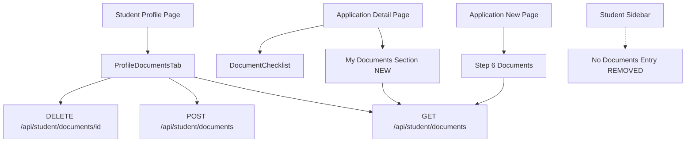

## Product Overview

将文档系统从集中式管理重构为以学生资料为核心的信息字段。移除独立的 Documents 页面，将文档上传功能完全集成到学生 Profile 页面，使文档成为学生个人信息的标准组成部分。同时确保在创建或查看申请时，该学生之前上传的所有文档能够自动展示并可在申请详情中引用。

## Core Features

1. **删除独立文档页面** - 移除 `/student-v2/documents` 整个页面目录及其路由
2. **移除侧边栏导航入口** - 从 StudentSidebar 的 navItems 中移除 "Documents" 条目
3. **重写 Profile 页面 Documents Tab** - 将其改造为唯一的文档管理主入口：

- 使用 `/api/student/documents` API（student-centric，无需选择应用）
- 移除"必须先选应用才能上传"的限制
- 保留统计卡片、状态筛选、文档列表（复用独立页面的成熟 UI）
- 支持按文档类型直接上传、下载、删除、重新上传被拒文档

4. **申请创建流程集成已有文档** - 在 `applications/new` Step 6 中自动检测该学生的已上传文档并预填充
5. **申请详情页面展示学生全部文档** - 在 `applications/[id]` 的 Documents Tab 中增加"我的文档库"区域，展示可关联的学生文档
6. **全局链接迁移** - 更新所有指向 `/student-v2/documents` 的引用为 `/student-v2/profile#documents`
7. **后端 API 保持不变** - `/api/student/documents` API 已是 student-centric 设计，无需修改

## Visual Effect

- 学生侧边栏不再显示 "Documents" 独立入口
- Profile 页面的 Documents Tab 成为功能完整的文档管理中心（包含上传、列表、筛选、统计）
- 申请详情页的 Documents Tab 同时显示：申请专属文档清单 + 该学生的所有可用文档（可供关联）
- 申请新建页面的文档步骤自动高亮已上传过的文档类型

## Tech Stack

- **Framework**: Next.js 16 (App Router) + React 19 + TypeScript 5
- **UI Components**: shadcn/ui (Card, Dialog, Badge, Select, Button, AlertDialog, Tabs, etc.)
- **Styling**: Tailwind CSS 4
- **Icons**: @tabler/icons-react (IconFiles, IconUpload, IconFile, IconCheck, IconX, etc.)
- **API**: Existing `/api/student/documents` (GET/POST), `/api/student/documents/[id]` (DELETE)
- **Utilities**: `@/lib/document-types` (getDocumentTypeLabel, denormalizeDocumentType, getDocumentTypeOptions, DocumentTypeSelect)
- **File Upload**: `@/components/ui/file-upload` (FileUpload, DocumentTypeSelect components)
- **Notifications**: sonner toast

## Implementation Approach

### Strategy: Decompose & Reconstruct

**核心思路**：独立文档页面的 UI 已经非常完善（统计卡片、状态筛选、完整 CRUD），而当前 Profile Documents Tab 的实现较简陋且依赖过时的 `/api/documents` API。因此最佳方案是将独立页面的成熟 UI 代码**提取并适配**到 ProfileDocumentsTab 组件中，然后删除独立页面。

### Key Technical Decisions

1. **ProfileDocumentsTab 重写** - 直接采用 `documents/page.tsx` 的 UI 模式（统计卡片区 + 筛选器 + 文档列表），但去掉 application_id 相关逻辑。使用 `/api/student/documents` 作为唯一数据源。
2. **API 统一** - 所有文档操作统一走 `/api/student/documents` 系列 API，废弃 ProfileTab 中对旧 `/api/documents` 的调用
3. **申请详情增强** - 在 DocumentChecklist 组件上方增加 "My Documents" 区域，调用 `/api/student/documents?status=verified,pending` 展示学生全部文档
4. **申请新建增强** - 在 docChecklist 加载后，对比学生已上传文档标记 `is_uploaded=true`
5. **链接迁移** - 所有 `/student-v2/documents` 链接改为 `/student-v2/profile#documents` 或 `/student-v2/profile`

### Data Flow

```
Student uploads doc → POST /api/student/documents (type, file) → documents table (student_id, type)
Profile tab fetches → GET /api/student/documents → all docs for student
Application detail fetches → GET /api/student/documents → shows available docs
Application new step → GET /api/student/documents → pre-marks uploaded types
```

## Architecture Design

### Component Relationship



## Directory Structure Summary

```
src/
├── app/
│   ├── (student-v2)/student-v2/
│   │   ├── documents/                    # [DELETE] 整个目录删除
│   │   │   └── page.tsx                  # [DELETE] 独立文档页面
│   │   ├── profile/page.tsx              # [MODIFY] 重写 ProfileDocumentsTab 组件
│   │   ├── applications/
│   │   │   ├── [id]/page.tsx             # [MODIFY] 增加 My Documents 区域
│   │   │   └── new/page.tsx             # [MODIFY] 预填充已上传文档
│   │   └── page.tsx                      # [MODIFY] 仪表盘链接更新
│   ├── api/student/documents/
│   │   ├── route.ts                      # [KEEP UNCHANGED] GET/POST API
│   │   └── [id]/route.ts                 # [KEEP UNCHANGED] DELETE API
│   └── (public)/apply/page.tsx           # [MODIFY] 链接更新
├── components/
│   ├── site-header.tsx                   # [MODIFY] 移除 routeTitles 中的 /student-v2/documents
│   └── student-v2/
│       ├── student-sidebar.tsx           # [MODIFY] 移除 Documents 导航项
│       └── document-checklist.tsx        # [MODIFY] 增加 showAllStudentDocs prop
└── lib/
    └── document-types.ts                 # [KEEP UNCHANGED] 文档类型定义
```

## Implementation Notes

1. **ProfileDocumentsTab 重写要点**:

- 复用 `documents/page.tsx` 的完整 UI 结构（Header+Stats+Filter+List）
- 接口改用 `/api/student/documents`（支持 status 过滤）
- 上传只需选 document_type，不需要选 application
- 删除使用 `/api/student/documents/[id]` DELETE
- 下载使用 `/api/documents/[id]/url` GET
- 引入 FileUpload 和 DocumentTypeSelect 组件
- 使用 denormalizeDocumentType 做类型显示兼容

2. **申请详情页 My Documents 区域**:

- 在 DocumentChecklist 上方新增 Card 区域
- 调用 `GET /api/student/documents` 获取学生所有文档
- 展示为紧凑列表，每项显示文档名、类型、状态、操作（查看/关联到本申请）
- 关联操作：PUT 更新该文档的 application_id 为当前申请 ID（需确认是否有此 API 或需新增）

3. **向后兼容**:

- 后端 API 完全不变，仅前端消费方式调整
- 通知页面的 mock 数据链接需要同步更新
- admin verify 路由中的通知链接需要更新
- site-header routeTitles 清理

4. **Blast radius 控制**:

- 仅修改前端组件和页面，不涉及数据库变更
- 不修改任何 API 路由文件
- 不影响管理员和合作伙伴的文档审核流程

## Design Approach: Clean Integration into Student Profile

The redesign focuses on seamlessly integrating document management as a natural extension of the student profile rather than a separate module. The Profile Documents Tab will adopt the polished, feature-rich UI from the current standalone documents page while adapting it to feel like a native part of the profile interface.

### Pages to Design/Modify

#### Page 1: Profile Documents Tab (Primary - Full Redesign)

**Block 1 - Header with Upload Action**
Clean header area showing "My Documents" title and description, with an inline upload dialog trigger button. The dialog uses DocumentTypeSelect for type selection followed by FileUpload component for drag-and-drop upload. No application selection needed.

**Block 2 - Statistics Cards Row**
Four compact stat cards in a responsive grid (Total, Verified, Pending, Rejected) using Card components with icons from tabler and bold numeric values. Same visual style as current standalone page.

**Block 3 - Filter Bar**
Horizontal filter bar with status dropdown (All/Pending/Verified/Rejected) and refresh button, contained within a Card.

**Block 4 - Document List**
Rich list view of documents, each item showing: colored status icon container, document type label (using getDocumentTypeLabel), status badge, filename with size, upload date, optional expiry badge, rejection reason alert, and action buttons (Download, Re-upload for rejected, Delete). Empty state shows icon + message + upload CTA.

#### Page 2: Application Detail - Documents Tab (Enhancement)

**Block 1 - My Documents Library (NEW)**
New section above existing DocumentChecklist. Shows the student's uploaded documents in a compact card format. Each document can be "linked" to the current application. Uses a subtle background differentiation from the checklist below.

**Block 2 - DocumentChecklist (Existing, Keep Unchanged)**
The existing program-specific document checklist remains as-is below the new section.

## Agent Extensions

### SubAgent

- **code-explorer**
- Purpose: 在实施过程中深入探索相关文件的完整内容，确保对每个修改点的精确理解
- Expected outcome: 准确定位 ProfileDocumentsTab 组件的完整代码范围、申请详情页 Documents Tab 的确切位置、以及所有需要更新的链接引用点