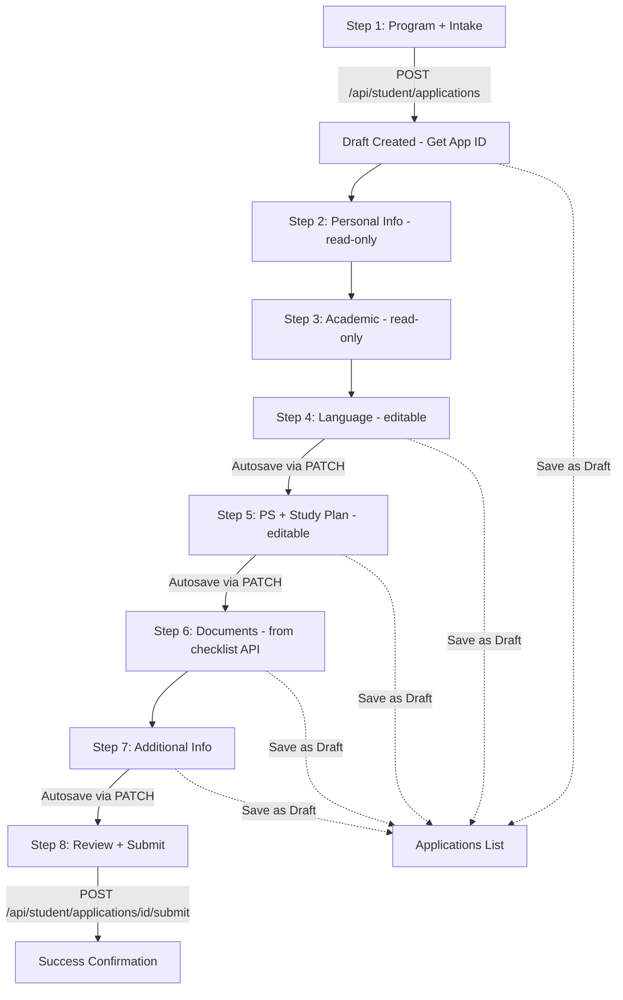

## Product Overview

Enhance the Add Application wizard in the student portal with a complete, working multi-step workflow that fixes critical data flow bugs and improves user experience.

## Core Features

- Fix critical bug: add Personal Statement & Study Plan input step (currently missing - data goes empty to API)
- Fix critical bug: add Intake selection UI on Step 1 (currently no way to select intake)
- Fix critical bug: ensure form data flows correctly to the API on submit
- Add step validation before allowing progression
- Add autosave with draft creation to prevent data loss
- Add Save as Draft button on every step
- Replace static document list with dynamic degree-specific checklist from API
- Add success confirmation after submission
- Add toast notifications for user feedback
- Add duplicate application warning on Step 1 after program selection

## Tech Stack

- Framework: Next.js 16 (App Router) with React 19 and TypeScript 5
- UI: shadcn/ui (Card, Button, Input, Label, Select, Textarea, Progress, Separator, Dialog, Toast)
- Icons: @tabler/icons-react (per AGENTS.md convention)
- Database: Supabase (PostgreSQL)
- Package Manager: pnpm

## Implementation Approach

**Strategy**: Rewrite the 7-step wizard into an 8-step wizard with proper data flow. The core issue is that `personal_statement`, `study_plan`, and `intake` have no input UI but are sent to the API as empty strings. The fix adds dedicated input steps and an autosave flow that creates a draft early, then incrementally saves progress.

**How it works**: On Step 1, after selecting a program and intake, clicking "Continue" creates a draft application via POST (getting back an application ID). Subsequent step changes autosave via PATCH to `/api/student/applications/[id]/autosave`. The final submit step validates all required fields and calls the submit endpoint.

**Key Technical Decisions**:

- **8-step wizard** (up from 7): New "Personal Statement & Study Plan" step inserted before Documents, and Intake selection moved to Step 1 alongside program selection. This ensures all data fields have corresponding input UI.
- **Draft-first autosave**: Creating the draft on Step 1 means we get an application ID early, which is needed for the document checklist API and autosave. The autosave endpoint already exists but only saves `personal_statement`, `study_plan`, `intake` — we'll expand it to include language and additional info fields.
- **Dynamic document checklist**: After draft creation, fetch checklist from `/api/student/applications/[id]/documents/checklist` which returns degree-specific requirements (Bachelor/Master/PhD). This replaces the current hardcoded list.
- **Validation**: Inline validation per step before allowing "Continue". Required field indicators with red asterisks, error messages shown below invalid fields.

## Implementation Notes

- The existing `useAutosave` hook in `src/hooks/use-autosave.tsx` works with `PATCH /api/student/applications/[id]/autosave` and includes a debounce mechanism and status indicator. Reuse this hook for the new flow.
- The autosave API only allows `personal_statement`, `study_plan`, `intake` fields. Need to expand to include `hsk_level`, `hsk_score`, `ielts_score`, `toefl_score`, `other_languages`, `scholarship_application`, `financial_guarantee`.
- The document checklist API requires an application ID, so it can only be called after the draft is created.
- Toast notifications: The project uses `sonner` for toasts (import `{ toast } from "sonner"`), as seen in other pages.
- Profile auto-fill fields (Steps 2, 3) remain read-only — users edit their profile separately.
- The `DuplicateApplicationWarning` component already exists and should be shown on Step 1 after program selection.

## Architecture Design



## Directory Structure

```
src/
├── app/
│   ├── (student-v2)/student-v2/
│   │   └── applications/
│   │       └── new/
│   │           └── page.tsx                    # [MODIFY] Complete rewrite: 8-step wizard with validation, autosave, dynamic docs, success confirmation
│   └── api/
│       └── student/
│           └── applications/
│               └── [id]/
│                   └── autosave/
│                       └── route.ts            # [MODIFY] Expand autosaveFields to include language, scholarship, financial fields
```

## Design Style

Professional form wizard design following shadcn/ui neutral theme. Clean, focused layout with clear step progression, inline validation feedback, and autosave status indicators. No decorative elements per AGENTS.md form page rules.

## Page Layout

- **Header**: Back button, title "New Application", subtitle
- **Step Progress Bar**: Horizontal step indicators with icons, active/completed/upcoming states, clickable completed steps
- **Step Content**: Card-based form sections with clear labels, required field indicators, and helpful descriptions
- **Footer**: Back/Continue/Save Draft/Submit buttons with consistent placement

## Step Designs (8 Steps)

1. **Select Program + Intake**: Program search combobox + intake dropdown + duplicate warning + program info card
2. **Personal Info**: Read-only profile grid with info banner, emergency contact section
3. **Academic Background**: Read-only education history cards + work experience cards
4. **Language Proficiency**: HSK level/score, IELTS/TOEFL scores, other languages textarea
5. **Personal Statement & Study Plan**: Two large textareas with character counters, template button, autosave indicator, word count
6. **Documents**: Dynamic checklist from API with upload slots, completion percentage bar
7. **Additional Information**: Extracurricular, awards, publications, research, scholarship, financial sections
8. **Review & Submit**: Collapsible review sections with Edit links, validation checklist, submit button

## SubAgent

- **code-explorer**: Used to verify existing patterns, confirm API contracts, and check component conventions during implementation to ensure consistency with current codebase

## Skill

- **supabase-postgres-best-practices**: Used to verify autosave endpoint field expansion follows best practices for update operations