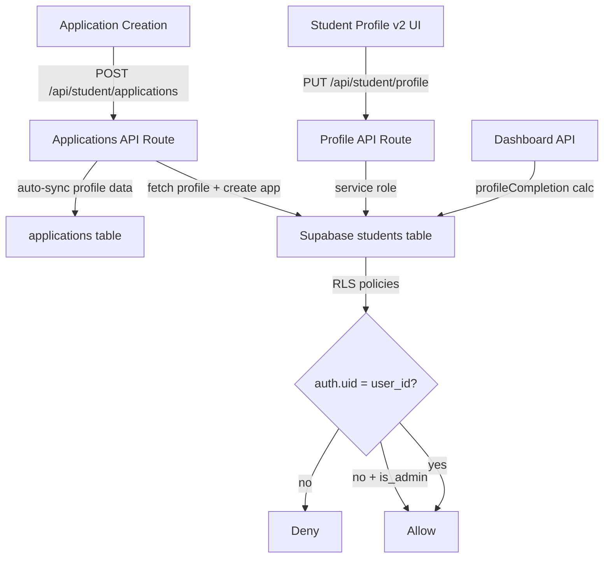

## Product Overview

Enhance the Student profile system to meet Chinese university admission requirements for international students, while ensuring data privacy through proper RLS policies and seamless profile-to-application data synchronization.

## Core Features

- Add 12+ China-specific fields to student profiles (Chinese name, marital status, religion, work experience, funding source, study mode, health condition, criminal record, previous China experience, visa type, WeChat ID, passport issuing country, postal code)
- Restructure profile UI into 5 tabs: Personal Info, Passport & Visa, Education & Work, Language Tests, China-Specific
- Fix critical RLS policy gaps: currently INSERT/UPDATE/SELECT on `students` table are permissive to public (no ownership check), allowing any user to read/modify any student record
- Add profile-to-application auto-sync: when creating a new application, pre-populate from student profile data
- Fix API safe-columns whitelist (missing 9 fields that exist in DB but are not writable via API)
- Unify profile completion calculation across profile API and dashboard API

## Tech Stack

- Framework: Next.js 16 (App Router) + React 19 + TypeScript 5
- UI: shadcn/ui + Tailwind CSS 4
- Database: Supabase PostgreSQL (external, at maqzxlcsgfpwnfyleoga.supabase.co)
- ORM: Drizzle ORM (schema in `src/storage/database/shared/schema.ts`)
- Migrations: Raw SQL files in `migrations/` directory
- Auth: Custom JWT-based via `@/lib/auth-utils.ts`

## Implementation Approach

Add new columns to the existing `students` table via a new migration (010), update the Drizzle schema to reflect them, fix the permissive RLS policies with proper `auth.uid() = user_id` checks and admin access, expand the API safe-columns whitelist to include all existing + new fields, restructure the v2 profile UI into 5 tabs, add profile sync logic to the application creation endpoint, and unify the profile completion calculation.

Key decisions:

- **Alter existing table vs. new table**: ALTER existing `students` table — all new fields are 1:1 with student, no normalization benefit from a separate table
- **RLS approach**: Replace overly permissive policies with `auth.uid() = user_id` for students, plus an `is_admin()` check for admin access — matching the pattern used in `applications` table
- **Profile sync**: On application creation, copy key profile fields into application metadata rather than requiring re-entry — uses existing `personal_statement`/`study_plan` pattern plus new profile snapshot
- **UI tabs**: Expand from 3 to 5 tabs to organize the 12+ new fields logically without overwhelming users

## Implementation Notes

- The API currently uses service role key (bypasses RLS), but RLS fix is still critical for direct client-side Supabase calls and future security posture
- The v2 profile `safeColumns` whitelist in `route.ts` line 143 is missing 9 existing fields (`current_address`, `emergency_contact_name`, `emergency_contact_phone`, `emergency_contact_relationship`, `field_of_study`, `gpa`, `hsk_score`, `toefl_score`, `permanent_address`) — must add these alongside new fields
- `calculateProfileCompletion()` in profile route only checks 11 fields; dashboard checks 12 different fields — must unify into a single shared function
- The deprecated v1 profile (`src/app/student/profile/page.tsx`) has some fields (emergency_contact_relationship, field_of_study, hsk_score, toefl_score) that v2 is missing — these must be brought into v2
- Migration must use `IF NOT EXISTS` / `ADD COLUMN IF NOT EXISTS` to be idempotent, following the pattern in migrations 005-009

## Architecture Design



## Directory Structure

```
project-root/
├── migrations/
│   └── 010_enhance_student_profile.sql          # [NEW] Add China-specific columns, fix RLS policies, add updated_at trigger, add indexes
├── src/
│   ├── storage/database/shared/
│   │   └── schema.ts                            # [MODIFY] Add new columns to students table definition, update RLS policies
│   ├── lib/
│   │   ├── student-api.ts                       # [MODIFY] Update StudentProfile, UpdateProfileRequest interfaces with all new fields
│   │   └── profile-completion.ts                # [NEW] Shared calculateProfileCompletion function used by both profile and dashboard APIs
│   ├── app/
│   │   ├── (student-v2)/student-v2/profile/
│   │   │   └── page.tsx                         # [MODIFY] Expand from 3 to 5 tabs, add all new fields, fix missing v1 fields
│   │   ├── api/student/
│   │   │   ├── profile/route.ts                 # [MODIFY] Expand safeColumns whitelist, use shared completion calc, add validation
│   │   │   ├── dashboard/route.ts               # [MODIFY] Use shared completion calc from profile-completion.ts
│   │   │   └── applications/route.ts            # [MODIFY] Add profile data sync on application creation
│   │   └── student/profile/page.tsx             # [MODIFY] Update deprecated v1 profile with new fields (consistency)
```

## Design Style

Professional education platform aesthetic with clean form layouts. The profile page uses a tabbed interface expanded from 3 to 5 tabs for better organization of China-specific fields. Follow existing shadcn neutral theme with primary accent colors.

## Layout

- Top: Header with title, profile completion progress bar, Refresh/Save buttons
- Middle: 5-tab layout (Personal Info, Passport & Visa, Education & Work, Language Tests, China-Specific)
- Each tab: Card containers with grid-based form fields (sm:grid-cols-2)
- Sections within tabs separated by Separator components
- Consistent field sizing: h-7 inputs, text-xs/relaxed labels following existing patterns

## Tab Structure

1. **Personal Info**: Name, email, phone, nationality, DOB, gender, address, emergency contact (existing + postal_code, religion, marital_status)
2. **Passport & Visa**: Passport number, expiry, issuing country, current visa type, photo upload placeholder
3. **Education & Work**: Highest education, institution, field of study, graduation date, GPA, work experience (new)
4. **Language Tests**: HSK level + score, IELTS, TOEFL (existing + add score fields that v1 has)
5. **China-Specific**: Chinese name, study mode, funding source, health condition, criminal record declaration, previous China experience, WeChat ID

## Agent Extensions

### Skill

- **supabase-postgres-best-practices**
- Purpose: Ensure the new migration SQL and RLS policies follow Supabase/Postgres best practices for performance and security
- Expected outcome: Optimized migration with proper indexes, efficient RLS policies, and correct trigger functions

### SubAgent

- **code-explorer**
- Purpose: Verify all files that reference student profile fields or the students table are identified for modification
- Expected outcome: Complete list of files needing updates, ensuring no regressions from schema changes