## Product Overview

An education consultancy platform (SICA) that assists international students in getting admission to Chinese universities. Students submit applications through a multi-step wizard, and the consultancy processes them to universities.

## Core Features

- **Student Profile**: 6-tab profile covering Personal Information, Passport, Academic & Language, Family, Additional Info (extracurricular/awards/publications/research/scholarship/financial), and Documents overview
- **Application Wizard**: 7-step wizard matching MD file specification: Select Program → Personal Information → Academic Background → Language Proficiency → Program Documents → Additional Information → Review & Submit
- **New Profile Fields**: Extracurricular activities, awards & achievements, publications, research experience, scholarship application, and financial guarantee
- **Document Upload**: Integrated into application wizard as Step 5, with per-application document management using existing application_documents table
- **Auto-fill from Profile**: Application wizard pre-fills data from student profile, allowing per-application edits

## Tech Stack

- Framework: Next.js 16 (App Router) with React 19 and TypeScript 5
- UI: shadcn/ui + Tailwind CSS 4
- Database: Supabase (PostgreSQL) with Drizzle ORM schema
- Package Manager: pnpm

## Implementation Approach

The strategy is layered: first extend the database schema and types, then update the API layer, then restructure the profile UI, and finally rebuild the application wizard. This ensures each layer is ready before the next depends on it. Profile stores master data; application wizard auto-fills from profile snapshot and allows per-application overrides. Document uploads remain per-application (not per-profile) since different programs require different documents.

**Key Technical Decisions**:

- New fields as JSONB arrays (extracurricular_activities, awards, publications, research_experience) following the existing pattern of education_history/work_experience/family_members
- scholarship_application and financial_guarantee as JSONB single objects (not arrays) since a student typically has one scholarship application and one financial guarantee per application cycle
- Language proficiency remains within the Academic tab as a distinct section (not a separate tab) to keep the profile at 6 tabs instead of 7, reducing tab fatigue
- Document uploads stay in the application wizard (Step 5), not in profile, because document requirements vary by program/university

## Implementation Notes

- Run migration SQL on Supabase before deploying code changes to ensure columns exist
- Profile page is ~890 lines; the restructured version will be significantly larger. Consider extracting tab content into separate components to keep the page manageable
- Application wizard new page is ~676 lines; expanding to 7 steps will also be large. Each step should be a separate component
- The profile_snapshot in applications table should capture all new fields to maintain data consistency
- Keep legacy single-education fields (highest_education, institution_name, etc.) for backward compatibility with existing data and admin views

## Architecture Design

```mermaid
graph TD
    A[Student Profile Page] --> B[6 Tabs]
    B --> B1[Personal Info]
    B --> B2[Passport]
    B --> B3[Academic & Language]
    B --> B4[Family]
    B --> B5[Additional Info]
    B --> B6[Documents Overview]
    
    C[Application Wizard] --> D[7 Steps]
    D --> D1[Select Program]
    D --> D2[Personal Info - autofill from profile]
    D --> D3[Academic Background - autofill]
    D --> D4[Language Proficiency - autofill]
    D --> D5[Program Documents - upload]
    D --> D6[Additional Info - autofill]
    D --> D7[Review & Submit]
    
    E[Students Table] --> F[New JSONB Columns]
    F --> F1[extracurricular_activities]
    F --> F2[awards]
    F --> F3[publications]
    F --> F4[research_experience]
    F --> F5[scholarship_application]
    F --> F6[financial_guarantee]
```



## Directory Structure Summary

All modifications are to existing files plus one new migration. No new directories needed.

```
src/
├── storage/database/shared/
│   └── schema.ts                    # [MODIFY] Add 6 new JSONB columns to students table
├── lib/
│   ├── student-api.ts               # [MODIFY] Add 6 new interfaces, extend StudentProfile and UpdateProfileRequest
│   └── profile-completion.ts        # [MODIFY] Add new fields to STUDENT_SAFE_COLUMNS and completion tracking
├── app/
│   ├── api/student/profile/
│   │   └── route.ts                 # [MODIFY] Add new fields to JSONB_ARRAY_FIELDS, extend safe columns validation
│   ├── api/student/applications/
│   │   ├── route.ts                 # [MODIFY] Extend profile_snapshot to include new fields
│   │   └── [id]/documents/checklist/
│   │       └── route.ts             # [MODIFY] Add missing document types to REQUIRED_DOCUMENTS_BY_DEGREE and labels
│   ├── (student-v2)/student-v2/
│   │   ├── profile/
│   │   │   └── page.tsx             # [MODIFY] Restructure from 4 tabs to 6 tabs, add Additional Info tab with all new fields
│   │   └── applications/
│   │       └── new/
│   │           └── page.tsx         # [MODIFY] Restructure from 3 steps to 7 steps matching MD file
migrations/
└── 011_add_additional_info_fields.sql  # [NEW] Migration to add 6 new JSONB columns with GIN indexes
```

## Profile Page Design (6 Tabs)

Restructure the student profile page from 4 tabs to 6 tabs using shadcn Tabs component. Each tab is a Card with CardHeader, CardContent. Multi-entry sections (education, work, family, extracurricular, awards, publications, research) use the existing pattern of "Add" button + bordered entry cards with "Remove" button. The Additional Info tab is the major new addition, containing 6 sub-sections each following the same multi-entry pattern.

## Application Wizard Design (7 Steps)

Restructure the new application page from 3 steps to 7 steps. Use a horizontal stepper with step numbers and labels. Each step auto-fills from profile data when available. Step 5 (Program Documents) integrates the existing file-upload component for document uploads per application. Step 7 (Review & Submit) shows a read-only summary of all sections with "Edit" links to jump back to specific steps.

## Visual Style

- Professional form design with shadcn neutral theme
- Clean card-based layout with proper spacing
- Consistent grid layouts (sm:grid-cols-2) for form fields
- Progress indicators for wizard steps
- Separator components between logical sections within tabs
- No decorative backgrounds - professional form aesthetic only

## SubAgent

- **code-explorer**: Used to verify existing patterns and find specific code references during implementation to ensure consistency with current codebase conventions